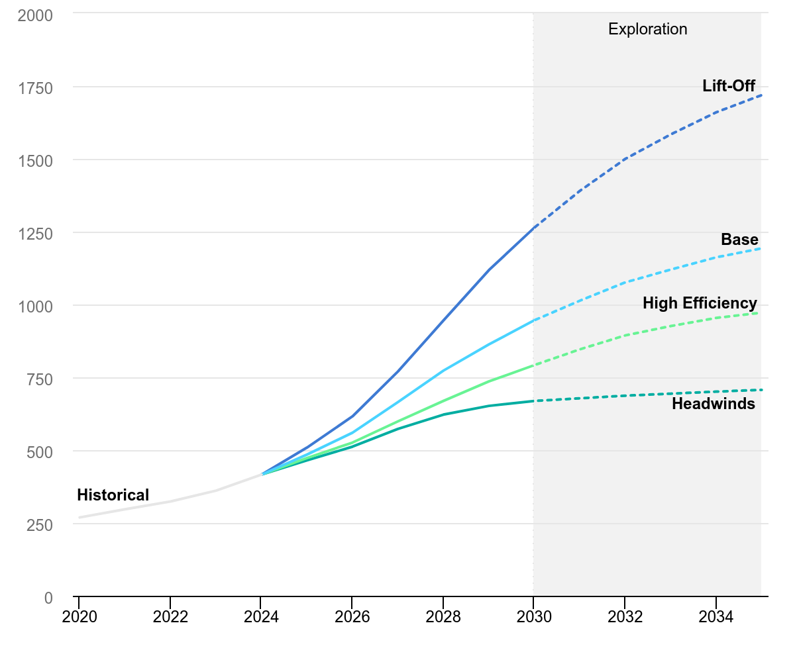

<p align="center">
  
</p>

<p align="center">
  
</p>

<h1 align="center">AI Energy Monitor</h1>

<p align="center">
  <strong>Track the energy consumption of your AI usage in watt-hours.</strong><br>
  A Chrome extension that monitors how much energy your AI chatbot interactions consume –<br>
  with real-time tracking, everyday comparisons, and energy-saving tips. All data stays local.
</p>

---

## The Problem

A single ChatGPT query uses about **10x more electricity** than a Google search. With over 800 million weekly ChatGPT users worldwide, the energy impact of AI is massive – yet invisible. Most people have no idea how much power their AI usage actually costs.

<p align="center">
  
  <br>
  <sub>Source: IEA – Global data centre electricity consumption forecast (2020–2035)</sub>
</p>

## The Solution

AI Energy Monitor makes AI energy consumption **visible and tangible**. It runs quietly in the background, tracks your usage across all major AI platforms, and translates raw watt-hours into relatable comparisons – like how long an LED lamp could run, or how far you could drive a car.

---

## Features

### Real-Time Tracking
- Automatic detection of AI chat sessions across 10+ platforms
- Per-query energy estimation based on published research data
- Daily, weekly, and monthly statistics in the popup

### Everyday Comparisons
Instead of abstract numbers, the extension shows what your consumption actually means:
- "That equals X Google searches"
- "Your AI usage could charge a phone to X%"
- "That's as much as a TV running all evening"

### Supported Platforms

| Always Active | Configurable | Optional |
|---|---|---|
| ChatGPT | Microsoft Copilot | DeepSeek |
| Google Gemini | Claude | Grok (xAI) |
| Perplexity | Google Search (AI Overviews) | Meta AI |
| | | Poe |
| | | GitHub Copilot |

### Energy-Saving Tips
Rotating tips that help reduce AI energy consumption:
- "Precise prompts = fewer follow-ups = less electricity"
- "'Answer briefly' – two words that can cut power consumption in half"
- "Before you ask: Maybe it's already in the docs?"

### Data Export
- **JSON** and **CSV** export for personal analysis
- Optional weekly Wh export for team dashboards

### Privacy First
- All data stored locally via `chrome.storage.local`
- No external servers, no tracking, no data leaves your device
- No chat content or prompts are ever recorded

---

## Installation

### Chrome Web Store
Install directly from the [Chrome Web Store](https://chromewebstore.google.com/) (search for "AI Energy Monitor").

### Manual Installation (Developer Mode)
1. Clone this repository
2. Open `chrome://extensions/` in Chrome
3. Enable **Developer mode** (top right)
4. Click **Load unpacked** and select the `extension/` folder

---

## Build

To create a Chrome Web Store ZIP package:

```bash
python build.py
```

This reads the version from `extension/manifest.json` and creates `AI Monitor v{version}.zip`.

---

## Research

The `docs/research/` folder contains the scientific basis for energy calculations:

- **Per-model energy estimates** (ChatGPT, Gemini, Claude, and more)
- **Reasoning model overhead** calculations
- **Web-based vs. CLI AI** comparison

All estimates are based on published data from the IEA, Sam Altman's blog, and peer-reviewed research.

---

## Internationalization

The extension supports **English** (default) and **German** via Chrome's i18n API. Language is determined automatically by the browser locale.

---

## Tech Stack

- **Chrome Extension** – Manifest V3, Service Worker, Content Scripts
- **Frontend** – Vanilla HTML/CSS/JS (no frameworks)
- **Charts** – Canvas API (popup sparkline)
- **i18n** – Chrome built-in `chrome.i18n`
- **Storage** – `chrome.storage.local`
- **Build** – Python script

---

## Privacy Policy

See [PRIVACY.md](PRIVACY.md) for the full privacy policy.

---

## License

This project is licensed under the [Creative Commons Attribution-NonCommercial-NoDerivatives 4.0 International License](https://creativecommons.org/licenses/by-nc-nd/4.0/).
